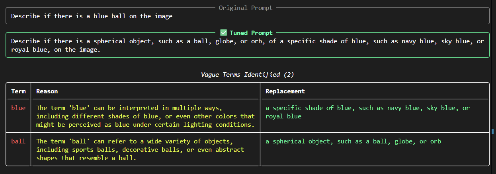

# AutoPromTune



## Overview

**AutoPromTune** is a Python tool that automatically improves user-written prompts by identifying vague, ambiguous, or underspecified terms and replacing them with precise, semantically richer descriptions.

It uses **large language models via an API** and **Jinja2 (`.j2`) templates** to keep the meta-prompts fully editable without touching Python code.

**Part of my research in the MSc final thesis on Artificial Intelligence**
*Author: Eduardo J. Barrios — GitHub [@edujbarrios](https://github.com/edujbarrios)*

---

## Architecture

```
autopromptune/
├── autopromptune/
│   ├── __init__.py
│   ├── core.py          ← orchestration logic
│   ├── llm_client.py    ← llm7.io OpenAI-compatible client
│   └── templates/
│       ├── identify_vague.j2   ← stage 1: detect vague terms
│       └── tune_prompt.j2      ← stage 2: rewrite the prompt
├── app.py               ← Streamlit web UI
├── cli.py               ← Click CLI
├── examples/
│   └── example_prompts.txt
├── .env.example
├── requirements.txt
└── README.md
```

---

## Quickstart

### 1. Install dependencies

```bash
pip install -r requirements.txt
```

### 2. Configure environment

```bash
cp .env.example .env
# The default key "unused" works with llm7.io — no registration needed.
```

### 3. Run the web UI

```bash
streamlit run app.py
```

### 4. Run via CLI

```bash
python cli.py tune "Describe if there is a blue ball on the image"
```

---

## How It Works

AutoPromTune runs in **two LLM passes**, both driven by Jinja2 templates:

| Pass | Template | Purpose |
|------|----------|---------|
| 1 | `identify_vague.j2` | Asks the LLM to list every vague term with a precise replacement |
| 2 | `tune_prompt.j2` | Rewrites the original prompt using the identified replacements |

The templates are plain text files with `{{ variable }}` and `` blocks — edit them freely to adjust the LLM's behaviour without changing Python code.


## License
 © 2026 Eduardo J. Barrios
